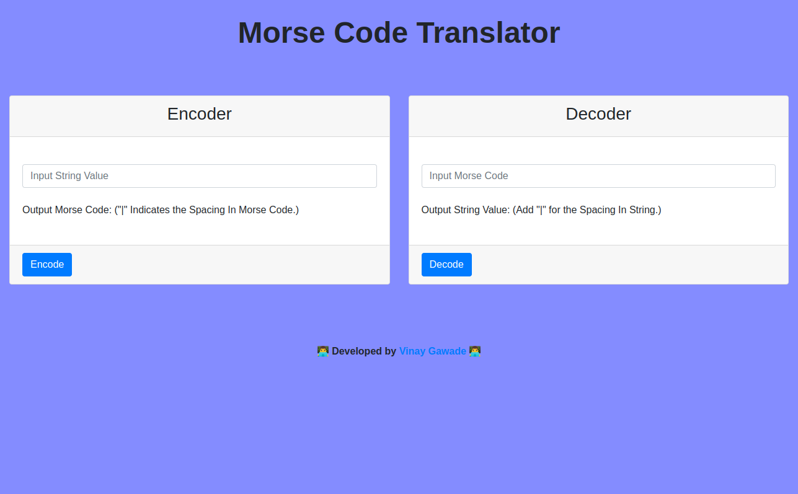

# Morse Code Translator

A simple Morse code translator that allows you to encrypt and decrypt messages.

Here's an image of the live site:

## Technologies Used

- Bootstrap 4
- JavaScript
- HTML

## Maintainer ✨

Built with 💛 by [Vinay Gawade](https://github.com/vinugawade).

---
